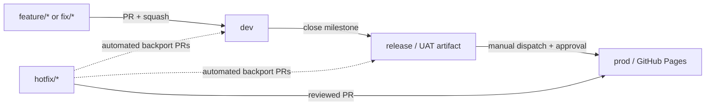

# GitHub Actions Flow

A working proof of concept for issue-driven development, automatic versioning,
environment promotion, and GitHub Pages delivery.



## What the POC demonstrates

- `feature/*` and `fix/*` PRs into `dev` require an issue-closing reference. The
  issue number must match the branch, belong to a milestone, and carry the
  matching `type:*` label.
- Every qualifying merge into `dev` advances PATCH in the bot-maintained
  [`VERSION`](VERSION) file and uploads an immutable Dev build artifact.
- Closing a milestone advances MINOR, or MAJOR when its title starts with
  `Major: `. The workflow merges `dev` into `release`, creates `vX.Y.Z-rc.1`,
  generates notes from milestone issues, and uploads a UAT artifact. It refuses
  to mix unreleased work from another milestone into the release.
- **Promote to production** is the only normal manual gate. It accepts no
  version input, requires approval in the `production` Environment, promotes
  the latest valid RC, publishes a GitHub Release, and deploys GitHub Pages.
- A reviewed `hotfix/*` PR into `prod` advances PATCH and deploys immediately
  through `production-hotfix`. It then opens labeled, no-bump backport PRs
  against `release` and `dev`.

GitHub Pages has one canonical site per repository. The `Environment Pages`
workflow keeps separate snapshots under stable paths in that site: the
`/production/`, `/dev/`, `/release/`, and feature pull-request previews under
`/previews/pr-<number>/`. The root page links to all currently published
snapshots. Each snapshot includes `build.json` and a page showing its exact
version, source branch, commit, build time, and environment. A merged feature
pull request removes its preview path.

## Repository layout

| Path | Purpose |
|---|---|
| `site/` | Dependency-free static demonstration page |
| `scripts/build.mjs` | Creates the immutable deployment artifact |
| `scripts/version.mjs` | Validates and advances `VERSION` |
| `scripts/validate-pr.mjs` | Enforces branch, issue, milestone, and label policy |
| `scripts/release-notes.mjs` | Builds categorized notes from milestone issues |
| `.github/workflows/` | CI, environment Pages, Dev, UAT, Production, and hotfix automation |
| `scripts/setup-repository.sh` | Idempotent GitHub repository bootstrap |
| `CONTRIBUTING.md` | Contributor and promotion runbook |

## Local verification

Node.js 22 or newer is sufficient; there are no package dependencies.

```bash
npm test
npm run build
npm run validate:workflows
```

The generated site is written to `dist/`.

## One-time GitHub setup

First merge this POC into `main`, then run the setup script from an authenticated
`gh` session with repository administration access:

```bash
PRODUCTION_REVIEWER=chrizspace \
BACKPORT_TOKEN='<fine-grained-token>' \
./scripts/setup-repository.sh
```

`BACKPORT_TOKEN` needs **Pull requests: read and write** and **Contents: read**
for this repository. It is stored as the `RELEASE_TOKEN` Actions secret. A
separate token is necessary because pull requests created by the default
`GITHUB_TOKEN` do not emit the events needed to run required CI checks.

The setup script:

1. Creates `dev`, `release`, and `prod` from `main`, then makes `dev` default.
2. Creates the `type:feature`, `type:fix`, `type:hotfix`, and `backport` labels.
3. Creates branch-scoped `dev`, `uat`, `production`, and
   `production-hotfix` Environments.
4. Makes `production` require the named reviewer and self-review prevention.
5. Configures Pages to deploy from GitHub Actions.
6. Installs a ruleset requiring review, CODEOWNERS, resolved conversations, CI,
   and protected history on all three long-lived branches.
7. Gives the GitHub Actions app a ruleset bypass for its deterministic version
   and promotion commits.

The script detects billing-plan limitations and completes all supported setup
instead of stopping partway through. On GitHub Free with a private repository:

- Environment required reviewers and repository rulesets are unavailable. The
  manual `workflow_dispatch` click remains the Production gate, but branches
  cannot receive the documented ruleset protection.
- GitHub Pages for the private repository is unavailable. Make the repository
  public or upgrade to a plan that includes private Pages before testing the
  final deployment.

The script prints these limitations as warnings. It never changes repository
visibility automatically.

## Demonstration

1. Create a milestone such as `Sprint 1`.
2. Create a Feature issue in that milestone.
3. Branch `feature/<issue>-demo-change` from `dev`, change the site, and open a
   PR to `dev` whose body contains `Closes #<issue>`.
4. Merge with **Squash and merge**. Download the Dev artifact and inspect its
   version metadata.
5. Close the milestone. Download the UAT artifact and inspect the generated
   release notes and `vX.Y.Z-rc.1` tag.
6. Run **Promote to production** from the `release` branch and approve the
   `production` Environment deployment.
7. Open the Pages URL shown on the deployment and the published GitHub Release.

For the full branch and merge policy, see [CONTRIBUTING.md](CONTRIBUTING.md).
